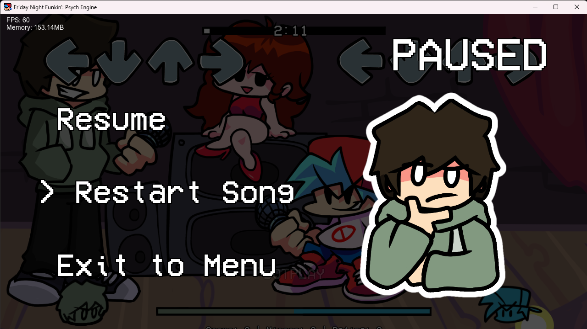

# Custom Pause Menu for Psych Engine

I made a custom pause menu for Psych Engine using Lua scripting as a personal hobby.
This can also be applied to your own MOD!


## Features
- Fully Lua-based custom pause menu   
- Images that change based on the selection
- Smoothly moving UI
- Compatible with the latest version (1.0.4h)
- You can also create your own pause menu by replacing the following images:
`pause_exit.png`
`pause_restart.png`
`pause_resume.png`

### Preview


## Installation
1. Copy the following folders into your Psych Engine mod directory:
```
mods/
└── your_mod_folder/
    ├── images/
    │   └── pausemenu/
    │       ├── pause_exit.png
    │       ├── pause_restart.png
    │       └── pause_resume.png
    └── scripts/
        └──CustomPausemenu.lua
```
2. Please verify that it matches the directory structure example above.
3. Launch the Psych Engine and test whether the pause menu functions.


## Notes
- Tested on **Psych Engine 1.0.4h** — at least it works on this version.  
- Compatibility with older versions is unknown.
- Depending on the image size, it may appear in an odd position. Please adjust the coordinates in `CustomPausemenu.lua`.

## Link
Required engine
[Psych engine](https://gamebanana.com/mods/309789)
